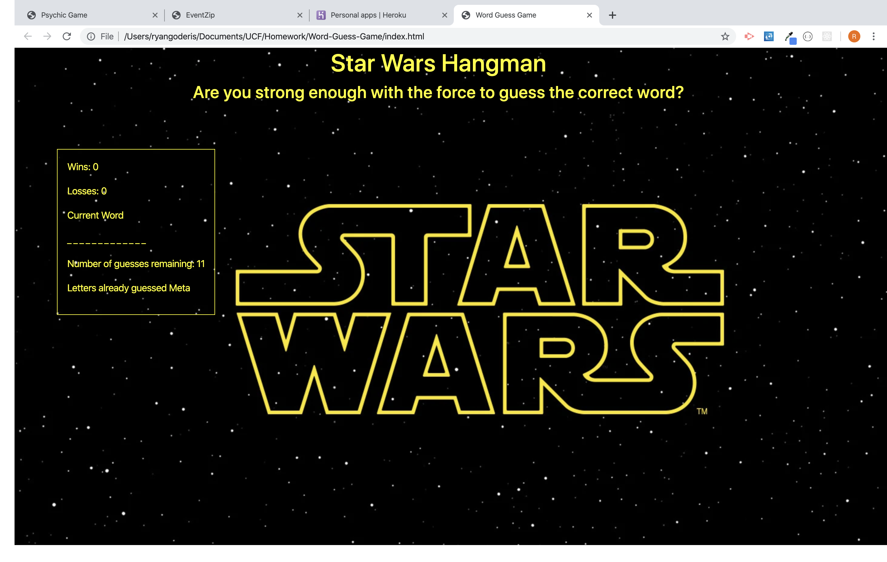
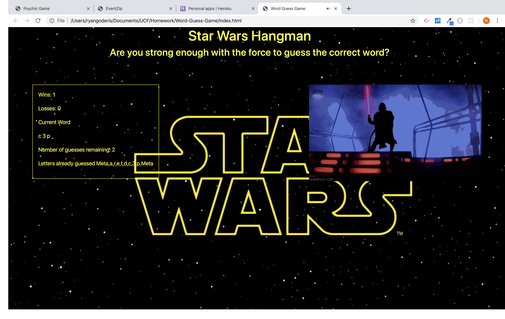

# Word Guess Game
Word Guess Game is a Star Wars hangman game that utilized JavaScript for logic and DOM manipulation.  The game pulls from an array of strings and has the user guess letters to see if they are in that word.
If the user guesses the correct letter it is displayed via a new string containing "_" demonstrating the unguessed letters.
If the user guesses the word then the win score increases and the game resets.  If the user guesses wrong then the guess left couter decreases and the guessed letter is pushed to the letters already guessed array.  When the guess left counter reaches 0 then the game is over and resets.  Depending on if the user guesses the correct letter, an incorrect letter, or guesses the word the DOM will display a different message.  If the user guesses the correct character then a gif plays of that character.

### Start Screen

### User Guess

[Word Guess Game](https://rgoderis.github.io/Word-Guess-Game/)